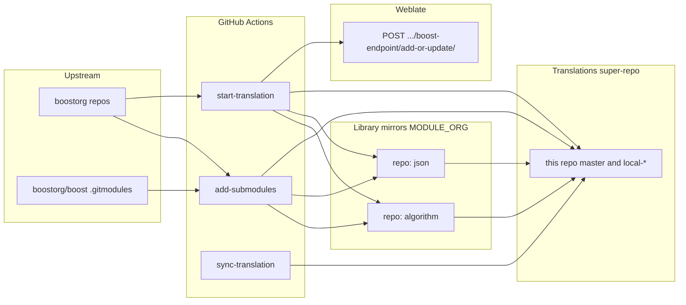

# Architecture — boost-docs-translation

This document describes **why** the system is shaped the way it is, **how** the main
pieces relate, and **which** concerns cut across workflows. For triggers, secrets,
and copy-paste examples, see [README.md](../README.md).

---

## 1. Problem and goals

**Context.** Boost ships documentation inside many separate **`boostorg`** repositories.
Translation work needs stable, narrow remotes (doc-only trees), language-specific
branches, and automation that does not clobber in-progress translator submissions.

**Goals.**

- **Mirror** each relevant library’s documentation into a dedicated GitHub repo under
  a configurable org (**`MODULE_ORG`**, from **`SUBMODULES_ORG`**).
- **Super-repo** (**this repository**): one checkout that pins exact commits of every
  mirrored lib via **`libs/<name>`** submodules on **`master`** and on
  **`local-{lang_code}`** branches.
- **Upstream sync**: refresh mirror **`master`** from **`boostorg`** at a chosen ref,
  then fold changes into **`local-*`** when safe.
- **Weblate handoff**: after successful git updates, tell the translation server which
  org, version, languages, and components changed so it can add or refresh projects
  asynchronously.
- **Consumer branches**: keep every **`local-*`** branch in the super-repo pointing at
  the latest **`local-*`** tip of each submodule (scheduled **`sync-translation`**).

Non-goals: building Boost, serving rendered HTML from this repo, or replacing
Weblate’s internal project configuration beyond the **`add-or-update`** contract.

---

## 2. System context

**Legend.** **`add-submodules`** may discover names from **`boostorg/boost`**;
**`start-translation`** discovers names from **this repo’s `.gitmodules`**. Both
mutate mirror repos and then update the super-repo. **`sync-translation`** only
moves submodule SHAs on existing **`local-*`** branches.

---

## 3. Repository layout (codemap)

| Path | Role |
|------|------|
| **`.gitmodules`** | Declares **`libs/<lib>`** → **`https://github.com/{MODULE_ORG}/{lib}.git`**, branch **`master`** for default checkout metadata. |
| **`.github/workflows/add-submodules.yml`** | On dispatch: create missing mirrors, push **`master`** / **`local-*`**, install **`create-tag.yml`**, record submodules in the super-repo. |
| **`.github/workflows/start-translation.yml`** | On dispatch: sync existing mirrors, merge policy on **`local-*`**, update super-repo pointers, call Weblate. |
| **`.github/workflows/sync-translation.yml`** | On dispatch or schedule: for each **`local-*`**, **`submodule update --remote`** and force-push. |
| **`.github/workflows/assets/env.sh`** | Derives **`ORG`**, **`TRANSLATIONS_REPO`**, **`MODULE_ORG`**, **`BOOST_ORG`**, **`MASTER_BRANCH`**, bot identity. |
| **`.github/workflows/assets/lib.sh`** | Shared implementation: GitHub **`gh`** helpers, clone/prune, **`meta/libraries.json`** parsing, translations-repo branch and submodule updates. |
| **`.github/workflows/assets/create-tag.yml`** | Template copied into each mirror; tags merged Weblate PRs (see **assets/README.md**). |
| **`scripts/trigger-*.sh`** | Optional local wrappers around **`repository_dispatch`**; no server-side logic. |

**Dependency direction.** Inline bash in **`add-submodules.yml`** and
**`start-translation.yml`** sources **`env.sh`** then **`lib.sh`**. **`sync-translation`**
sources only **`env.sh`** (git-only loop, no **`lib.sh`**).

---

## 4. Branch model

| Branch | Where | Meaning |
|--------|--------|---------|
| **`master`** | Mirror and super-repo | Doc-only content aligned with upstream English sources for the synced ref. |
| **`local-{lang_code}`** | Mirror and super-repo | Translation line for **`lang_code`**; Weblate opens PRs from **`translation-{lang_code}-*`** into this branch on mirrors. |
| **`translation-{lang_code}-{version}`** | Mirror (head of PR) | Weblate working branch naming assumed by **`start-translation`** (open PR guard) and **`create-tag.yml`** (tag extraction). |

**Super-repo `local-*` vs mirror `local-*`.** The super-repo’s **`local-*`** branch
commits **submodule pointers** that track each mirror’s **`local-*`** (after
**`finalize_translations_repo`** / **`sync-translation`**). The mirror’s **`local-*`**
holds **actual file** merges from **`master`** plus translator edits.

---

## 5. Control and data flows

### 5.1 Add mirrors (**`add-submodules`**)

1. Resolve library names: **`client_payload.submodules`** or **`boostorg/boost`**
   **`.gitmodules`** at **`LIBS_REF`**.
2. For each name: **`get_doc_paths`** ( **`meta/libraries.json`** ) → clone
   **`boostorg/{name}`** → **`prune_to_doc_only`**.
3. If mirror missing: **`gh repo create`**, init from pruned tree, push **`master`**,
   branch **`local-*`** with **`create-tag.yml`** committed on each.
4. Clone super-repo to a temp dir; **`ensure_local_branch_in_translations`** per
   language; for each updated lib, **`update_translations_submodule`** on **`master`**
   and each **`local-*`**; push ( **`local-*`** force-pushed in **`finalize_translations_repo`** ).

### 5.2 Sync and notify (**`start-translation`**)

1. Submodule names from **this** repo **`.gitmodules`** (**`libs/`** only).
2. Per lib: clone upstream and mirror, replace mirror **`master`** tree with pruned
   upstream snapshot, push.
3. Per **`lang_code`**: if **`local-*`** exists and an open PR matches
   **`translation-{lang_code}-*`** → skip merge for that pair; else create branch or
   **`merge origin/master`** into **`local-*`** and push.
4. **`finalize_translations_repo`**: refresh **`UPDATES`** submodules on **`master`**
   (normal push) and on each **`local-*`** (**`--force`**).
5. Build **`add_or_update`** map only for languages that had at least one successful
   update; **`jq`**-construct JSON; **POST** to Weblate **`boost-endpoint`**; tolerate
   **202** (async) or **200**.

### 5.3 Pointer roll-up (**`sync-translation`**)

1. List **`refs/heads/local-*`** on the super-repo.
2. For each branch: checkout, **`git submodule update --init`**, set
   **`submodule.<path>.branch`**, **`submodule update --remote`**, commit, **`push --force`**.

---

## 6. Cross-cutting concerns

**Authentication.** **`SYNC_TOKEN`** is passed to **`actions/checkout`** and
**`GITHUB_TOKEN`** for **`gh`** and **`gh auth setup-git`**, so pushes and API calls
share one credential. **`WEBLATE_TOKEN`** is only used for the outbound HTTP call.

**Idempotency and safety.**

- **`add-submodules`** skips if the mirror repo already exists.
- **`start-translation`** skips mirror **`master`** merge into **`local-*`** when a
  Weblate PR is open, reducing race risk with translators.
- **`create-tag`** skips if the derived tag already exists.

**Observability.** Shell steps echo progress to Actions logs; Weblate response bodies
are printed for **`start-translation`** on success or failure paths where implemented.

**Configuration surface.** **`env.sh`** centralizes org and branch constants; workflow
YAML supplies **`LIBS_REF`**, **`LANG_CODES`**, **`EXTENSIONS`**, and secrets so
behavior is traceable without reading the entire inline script.

---

## 7. Stability of this document

Update this file when **branch naming**, **Weblate contract**, **ownership model**
(**`MODULE_ORG`**), or **repository layout** changes. Routine secret rotation or
version bumps in **`actions/checkout`** alone do not require edits here.
