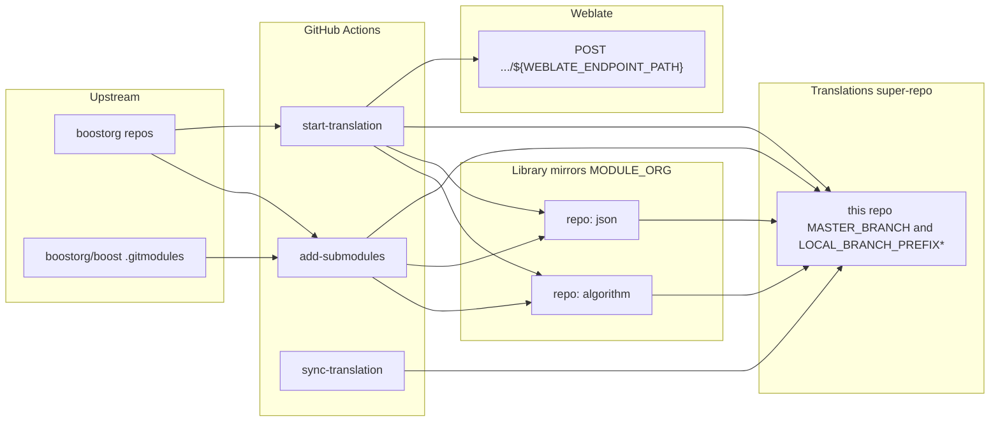
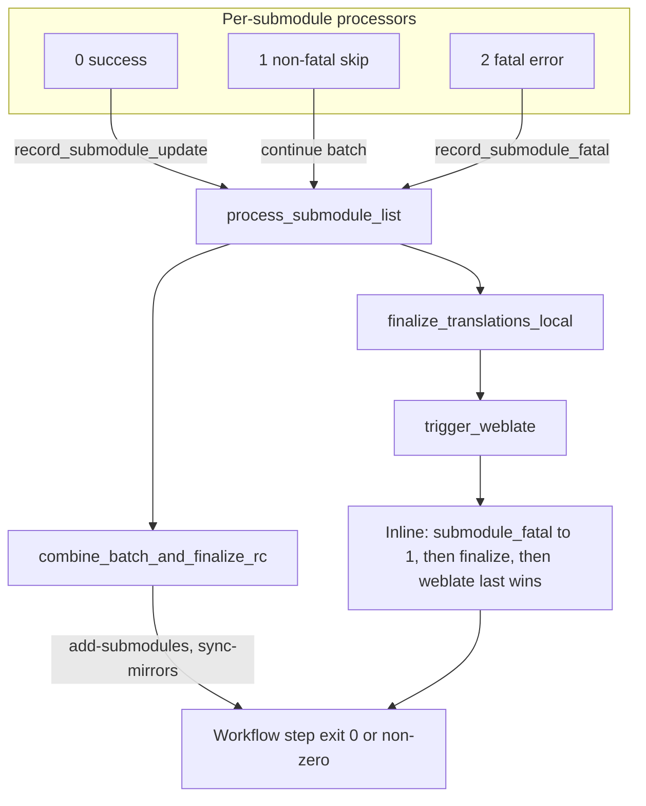

# Architecture — boost-docs-translation

This document describes **why** the system is shaped the way it is, **how** the main
pieces relate, and **which** concerns cut across workflows. For triggers, secrets,
and copy-paste examples, see [README.md](../README.md). For a zero-to-operational
walkthrough, see [GETTING-STARTED.md](GETTING-STARTED.md).

---

## 1. Problem and goals

**Context.** Boost ships documentation inside many separate **`boostorg`** repositories.
Translation work needs stable, narrow remotes (doc-only trees), language-specific
branches, and automation that does not clobber in-progress translator submissions.

**Goals.**

- **Mirror** each relevant library’s documentation into a dedicated GitHub repo under
  a configurable org (**`MODULE_ORG`**, from **`SUBMODULES_ORG`**).
- **Super-repo** (**this repository**): one checkout that pins exact commits of every
  mirrored lib via **`libs/<name>`** submodules on **`MASTER_BRANCH`** and on
  **`${LOCAL_BRANCH_PREFIX}{lang_code}`** branches.
- **Upstream sync**: refresh mirror **`MASTER_BRANCH`** from **`boostorg`** at a chosen ref,
  then fold changes into **`${LOCAL_BRANCH_PREFIX}*`** when safe.
- **Weblate handoff**: after successful git updates, tell the translation server which
  org, version, languages, and components changed so it can add or refresh projects
  asynchronously.
- **Consumer branches**: keep every **`${LOCAL_BRANCH_PREFIX}*`** branch in the super-repo pointing at
  the latest **`${LOCAL_BRANCH_PREFIX}*`** tip of each submodule (scheduled **`sync-translation`**).

Non-goals: building Boost, serving rendered HTML from this repo, or replacing
Weblate’s internal project configuration beyond the **`add-or-update`** contract.

---

## 2. System context

```mermaid
flowchart LR
  subgraph upstream [Upstream]
    BO[boostorg repos]
    BB[boostorg/boost .gitmodules]
  end

  subgraph ci [GitHub Actions]
    AS[add-submodules]
    ST[start-translation]
    SY[sync-translation]
  end

  subgraph mirrors [Library mirrors MODULE_ORG]
    M1["repo: algorithm"]
    M2["repo: json"]
  end

  subgraph super [Translations super-repo]
    TR["this repo MASTER_BRANCH and LOCAL_BRANCH_PREFIX*"]
  end

  subgraph tw [Weblate]
    EP["POST .../${WEBLATE_ENDPOINT_PATH}"]
  end

  BB --> AS
  BO --> AS
  BO --> ST
  AS --> M1
  AS --> M2
  ST --> M1
  ST --> M2
  AS --> TR
  ST --> TR
  ST --> EP
  M1 --> TR
  M2 --> TR
  SY --> TR
```

**Legend.** **`add-submodules`** may discover names from **`boostorg/boost`**;
**`start-translation`** discovers names from **this repo’s `.gitmodules`**. Both
mutate mirror repos and then update the super-repo. **`sync-translation`** only
moves submodule SHAs on existing **`${LOCAL_BRANCH_PREFIX}*`** branches.

---

## 3. Repository layout (codemap)

| Path | Role |
|------|------|
| **`.gitmodules`** | Declares **`libs/<lib>`** → **`https://github.com/{MODULE_ORG}/{lib}.git`**, branch **`master`** for default checkout metadata. |
| **`.github/workflows/add-submodules.yml`** | On dispatch: create missing mirrors, push **`master`** / **`local-*`**, install **`create-tag.yml`**, record submodules in the super-repo. |
| **`.github/workflows/start-translation.yml`** | On dispatch: **`setup`** → **`sync-mirrors`** → **`start-local`** matrix (per lang); sync mirrors, merge policy on **`local-*`**, update super-repo pointers, call Weblate. |
| **`.github/workflows/sync-translation.yml`** | On dispatch or schedule: **`discover`** → **`sync-local`** matrix (per lang); **`submodule update --remote`** and force-push per **`local-*`**. |
| **`.github/workflows/assets/env.sh`** | Derives **`ORG`**, **`TRANSLATIONS_REPO`**, **`MODULE_ORG`**, **`BOOST_ORG`**, **`MASTER_BRANCH`**, **`LOCAL_BRANCH_PREFIX`**, **`TRANSLATION_BRANCH_PREFIX`**, **`WEBLATE_ENDPOINT_PATH`**, bot identity. |
| **`.github/workflows/assets/lib.sh`** | Shared implementation: GitHub **`gh`** helpers, clone/prune, **`meta/libraries.json`** parsing, translations-repo branch and submodule updates. |
| **`.github/workflows/assets/create-tag.yml`** | Template copied into each mirror; tags merged Weblate PRs (see **assets/README.md**). |
| **`scripts/trigger-*.sh`** | Optional local wrappers around **`repository_dispatch`**; no server-side logic. |

**Dependency direction.** Inline bash in **`add-submodules.yml`**,
**`start-translation.yml`**, and **`sync-translation.yml`** sources **`env.sh`** then
**`lib.sh`**. **`add-submodules`** and **`start-translation`** call
**`parse_and_validate_lang_codes`** once per run; **`sync-translation`** uses
**`validate_lang_codes`** in **`discover`** only; submodule pointer updates remain inline git.

---

## 4. Branch model

| Branch | Where | Meaning |
|--------|--------|---------|
| **`MASTER_BRANCH`** (`master`) | Mirror and super-repo | Doc-only content aligned with upstream English sources for the synced ref. |
| **`${LOCAL_BRANCH_PREFIX}{lang_code}`** | Mirror and super-repo | Translation line for **`lang_code`**; Weblate opens PRs from **`${TRANSLATION_BRANCH_PREFIX}{lang_code}-*`** into this branch on mirrors. |
| **`${TRANSLATION_BRANCH_PREFIX}{lang_code}-{version}`** | Mirror (head of PR) | Weblate working branch naming assumed by **`start-translation`** (open PR guard) and **`create-tag.yml`** (tag extraction). |

Constants **`MASTER_BRANCH`**, **`LOCAL_BRANCH_PREFIX`**, and **`TRANSLATION_BRANCH_PREFIX`** are defined in **`.github/workflows/assets/env.sh`**.

**Super-repo `local-*` vs mirror `local-*`.** The super-repo’s **`local-*`** branch
commits **submodule pointers** that track each mirror’s **`local-*`** (after
**`finalize_translations_repo`** / **`sync-translation`**). The mirror’s **`local-*`**
holds **actual file** merges from **`master`** plus translator edits.

---

## 5. Control and data flows

### 5.1 Add mirrors (**`add-submodules`**)

1. Resolve library names: **`client_payload.submodules`** or **`boostorg/boost`**
   **`.gitmodules`** at **`LIBS_REF`**.
2. For each name: **`get_doc_paths`** ( **`meta/libraries.json`** ) → clone
   **`boostorg/{name}`** → **`prune_to_doc_only`**.
3. If mirror missing: **`gh repo create`**, init from pruned tree, push **`master`**,
   branch **`local-*`** with **`create-tag.yml`** committed on each.
4. Clone super-repo to a temp dir; **`ensure_local_branch_in_translations`** per
   language; for each updated lib, **`update_translations_submodule`** on **`master`**
   and each **`local-*`**; push ( **`local-*`** force-pushed in **`finalize_translations_repo`** ).

### 5.2 Sync and notify (**`start-translation`**)

1. **`setup`**: validate language codes; emit JSON for the matrix.
2. **`sync-mirrors`** (serialized via **`translations-mirror-master`**): submodule names from **this** repo **`.gitmodules`** (**`libs/`** only); per lib, clone upstream and mirror, replace mirror **`master`** tree with pruned upstream snapshot, push; **`finalize_translations_master`** on the super-repo.
3. **`start-local`** (matrix per **`lang_code`**, concurrency **`local-branch-{lang_code}`**): per lib, create or merge **`${LOCAL_BRANCH_PREFIX}*`** in mirrors when no open **`${TRANSLATION_BRANCH_PREFIX}{lang_code}-*`** PR; **`finalize_translations_local`** for that language; build **`add_or_update`** for that lang; **POST** to **`${WEBLATE_ENDPOINT_PATH}`**; tolerate **202** (async) or **200**.

### 5.3 Pointer roll-up (**`sync-translation`**)

1. **`discover`**: list **`refs/heads/local-*`** on the super-repo; emit JSON for the matrix.
2. **`sync-local`** (matrix per **`lang_code`**, concurrency **`local-branch-{lang_code}`**): checkout one **`local-*`** branch, **`git submodule update --init`**, set **`submodule.<path>.branch`**, **`submodule update --remote`**, commit, **`push ----force-with-lease`**.

---

## 6. Shell return codes

Per-submodule processors in **`.github/workflows/assets/`** share a **three-code return
convention**. Workflow steps collapse these into a **job exit status** (0 or non-zero;
**`2` is never propagated** to the GitHub Actions step exit code).

```mermaid
flowchart TD
  subgraph processors [Per-submodule processors]
    A0["0 success"]
    A1["1 non-fatal skip"]
    A2["2 fatal error"]
  end
  PSL[process_submodule_list]
  CB[combine_batch_and_finalize_rc]
  FTL[finalize_translations_local]
  TW[trigger_weblate]
  Compose["Inline: submodule_fatal to 1, then finalize, then weblate last wins"]
  JobExit["Workflow step exit 0 or non-zero"]

  A0 -->|"record_submodule_update"| PSL
  A1 -->|"continue batch"| PSL
  A2 -->|"record_submodule_fatal"| PSL
  PSL --> CB
  PSL --> FTL
  CB -->|"add-submodules, sync-mirrors"| JobExit
  FTL --> TW --> Compose --> JobExit
```

### 6.1 Per-submodule batch processors

Functions passed to **`process_submodule_list`** in **`submodule_ops.sh`**:

| Code | Meaning | Recorded in | Examples |
|------|---------|-------------|----------|
| **0** | Success | **`UPDATES`** | Mirror synced; repo created; local branch ready for Weblate |
| **1** | Non-fatal skip (batch continues) | Summary buckets (**`NO_DOC_PATHS`**, **`REPO_EXISTS_SKIP`**, **`OPEN_PR_SKIP`**) | No doc paths; mirror repo already exists; open translation PR |
| **2** | Fatal submodule error | **`SUBMODULE_FATAL`** / **`submodule_fatal`** | Git clone/push/commit failure; missing org mirror; **`libraries.json`** fetch failure; invalid **`START_PHASE`**; **`has_open_translation_pr`** API failure |

Processors that follow this contract:

- **`add_one_submodule`** (**`add_submodules.sh`**) — **`return 1`** when the mirror repo
  already exists or metadata has no doc paths; **`return 2`** for git/gh/metadata failures.
- **`sync_one_submodule`** (**`translation.sh`**) — **`return 1`** when metadata has no doc
  paths or no language was added for the submodule; **`return 2`** for git/clone/sync failures.
- **`process_local_branch`** (**`translation.sh`**) — **`0`** = eligible for Weblate
  **`add_or_update`**; **`1`** = skipped due to open translation PR; **`2`** = git/API failure.

### 6.2 Orchestration

**`process_submodule_list`** (**always returns 0**):

- **`rc == 0`**: calls **`record_submodule_update`**.
- **`rc == 1`**: ignored for exit purposes; batch continues.
- **`rc == 2`**: calls **`record_submodule_fatal`**; increments **`submodule_fatal`**.

**`combine_batch_and_finalize_rc finalize_rc [weblate_rc]`**:

1. Start **`exit_rc=0`**.
2. If **`submodule_fatal > 0`** → **`exit_rc=1`** (fatals are collapsed, not propagated as **`2`**).
3. If **`finalize_rc != 0`** → **`exit_rc=$finalize_rc`** (**finalize wins** over batch fatal).
4. If **`weblate_rc != 0`** (optional second arg, default **`0`**) → **`exit_rc=$weblate_rc`** (**weblate wins** over finalize and batch fatal).

### 6.3 Workflow job exit

| Workflow step | Collapse logic |
|---------------|----------------|
| **`add-submodules.yml`** | **`add_submodules_main`** → **`combine_batch_and_finalize_rc`** |
| **`start-translation.yml`** **`sync-mirrors`** | **`combine_batch_and_finalize_rc "$rc"`** after **`finalize_translations_master`** |
| **`start-translation.yml`** **`start-local`** | **`combine_batch_and_finalize_rc "$rc" "$weblate_rc"`** after **`finalize_translations_local`** and **`trigger_weblate`** (Weblate runs only when finalize succeeded; collapse still considers all three sources) |

On partial submodule failure, **`sync-mirrors`** still finalizes successful submodule
pointers in the super-repo, then exits non-zero so downstream jobs can distinguish full
success from partial failure.

### 6.4 Related conventions (not the batch 0/1/2 contract)

| Helper | Convention |
|--------|------------|
| **`has_open_translation_pr`** (**`lib.sh`**) | Separate tri-state: **`0`** = open PR exists, **`1`** = none, **`2`** = GitHub API failure |
| **`get_doc_paths`** | Returns **`1`** on API failure; callers upgrade to processor **`return 2`** after recording **`META_MISSING`** |
| Setup-phase helpers (**`resolve_add_submodules_names`**, **`ensure_all_translation_lang_branches`**, **`ensure_translations_cloned`** failures) | Return **non-zero (fail)** and cause **immediate job `exit`** before batch processing; **`resolve_add_submodules_names`** hard-exits **`1`**, while **`ensure_translations_cloned`** / **`ensure_all_translation_lang_branches`** propagate the failing command's exit status (e.g. git **`128`**) via **`rc=$?` capture and `exit $rc`** |
| **`trigger_weblate`** (**`translation.sh`**) | **`0`** success or empty skip; **`1`** validation or HTTP/curl failure |
| **`validate_secrets`** / **`parse_and_validate_lang_codes`** | **`exit 1`** (fatal to entire step) |
| **`sync-translation.yml`** | Does **not** use this convention |
| **`scripts/trigger-*.sh`** | **`exit 0`** success (including **`--help`**); **`exit 1`** for any client/dispatch error — **does not participate** in the 0/1/2 batch contract |

---

## 7. Cross-cutting concerns

**Authentication.** **`SYNC_TOKEN`** is passed to **`actions/checkout`** and
**`GITHUB_TOKEN`** for **`gh`** and **`gh auth setup-git`**, so pushes and API calls
share one credential. **`WEBLATE_TOKEN`** is only used for the outbound HTTP call.

**Idempotency and safety.**

- **`add-submodules`** skips if the mirror repo already exists.
- **`start-translation`** skips mirror **`master`** merge into **`local-*`** when a
  Weblate PR is open, reducing race risk with translators.
- **`create-tag`** skips if the derived tag already exists.

**Workflow concurrency.**

- **Per-language group:** **`local-branch-{lang_code}`** — shared by **`start-translation`**
  (**`start-local`** matrix) and **`sync-translation`** (**`sync-local`** matrix). Jobs
  targeting the same language queue; **`cancel-in-progress: false`** so in-flight work
  completes rather than being cancelled.
- **Mirror-master group:** **`translations-mirror-master`** — serializes mirror **`master`**
  sync inside **`start-translation`** (**`sync-mirrors`** job) so parallel per-language
  jobs do not race on shared mirror repos.
- **Example:** a manual **`start-translation`** dispatch for **`ja`** waits if
  **`sync-translation`** already has a **`sync-local`** job running for **`local-ja`**.
  **`zh_Hans`** and **`ja`** jobs from the same workflow run can still execute in parallel.

**Observability.** Shell steps echo progress to Actions logs; Weblate response bodies
are printed for **`start-translation`** on success or failure paths where implemented.

**Configuration surface.** **`env.sh`** centralizes org and branch constants
(**`MASTER_BRANCH`**, **`LOCAL_BRANCH_PREFIX`**, **`TRANSLATION_BRANCH_PREFIX`**,
**`WEBLATE_ENDPOINT_PATH`**); workflow YAML supplies **`LIBS_REF`**, **`LANG_CODES`**,
**`EXTENSIONS`**, and secrets so behavior is traceable without reading the entire inline script.

---

## 8. Stability of this document

Update this file when **branch naming**, **Weblate contract**, **ownership model**
(**`MODULE_ORG`**), or **repository layout** changes. Routine secret rotation or
version bumps in **`actions/checkout`** alone do not require edits here.

Consumer-facing semver for the orchestration contract is tracked in
**[CHANGELOG.md](../CHANGELOG.md)** and
**[endpoint-contract.md § Versioning and stability](endpoint-contract.md#versioning-and-stability)**.
