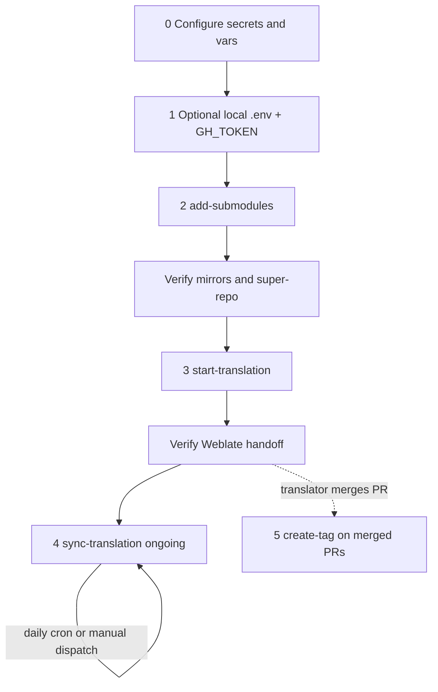

# Getting started (end to end)

Ordered walkthrough from an empty translations repository to a fully operational
Boost documentation translation pipeline. For per-workflow field detail see
[README.md](../README.md); for design and return codes see
[ARCHITECTURE.md](ARCHITECTURE.md); for HTTP and dispatch shapes see
[endpoint-contract.md](endpoint-contract.md). If you pin automation to a semver tag,
check [CHANGELOG.md](../CHANGELOG.md) before upgrading.

Branch names and the Weblate path are defined in
[`.github/workflows/assets/env.sh`](../.github/workflows/assets/env.sh):
`MASTER_BRANCH`, `LOCAL_BRANCH_PREFIX`, `TRANSLATION_BRANCH_PREFIX`,
`WEBLATE_ENDPOINT_PATH`. Examples below use current defaults (`master`, `local-`,
`translation-`, `boost-endpoint/add-or-update/`).



---

## 0. Prerequisites — GitHub secrets and variables

Configure these on the translations repository **before** dispatching any workflow:
**Settings → Secrets and variables → Actions**.

| Kind     | Name             | Where documented |
| -------- | ---------------- | ---------------- |
| Secret   | `SYNC_TOKEN`     | [README § Required secrets](../README.md#required-secrets) |
| Secret   | `WEBLATE_URL`    | [README § Required secrets](../README.md#required-secrets) |
| Secret   | `WEBLATE_TOKEN`  | [README § Required secrets](../README.md#required-secrets) |
| Variable | `LANG_CODES`     | [README § Repository variables](../README.md#repository-variables) |
| Variable | `SUBMODULES_ORG` | [README § Repository variables](../README.md#repository-variables) |

`SYNC_TOKEN`, `WEBLATE_URL`, and `WEBLATE_TOKEN` are required secrets;
`LANG_CODES` and optional `SUBMODULES_ORG` are repository variables. See the
linked README sections for scope, format, and which workflows consume each value.

---

## 1. Local trigger setup (optional)

To fire dispatches from a clone of this repo instead of the GitHub API or UI:

```bash
cp .env.example .env   # set GH_TOKEN (GITHUB_TOKEN is also accepted)
```

- **`GH_TOKEN`** is **client-side only** — permission to call
  `POST /repos/{owner}/{repo}/dispatches`. Workflows still use the GitHub
  **secrets** from step 0 on the server.
- Requires **curl** and **jq** or Python 3.

See [README § Scripts](../README.md#scripts-local-repository_dispatch) for script
details.

---

## 2. `add-submodules` — create mirrors and register submodules

**When:** greenfield setup or adding new library mirrors.

| Item     | Value                                                                 |
| -------- | --------------------------------------------------------------------- |
| Workflow | [`.github/workflows/add-submodules.yml`](../.github/workflows/add-submodules.yml) |
| Script   | `scripts/trigger-add-submodules.sh`                                   |
| Trigger  | `repository_dispatch` with `event_type: add-submodules`               |

### Trigger (JSON)

POST to `https://api.github.com/repos/{owner}/{repo}/dispatches`:

```json
{
  "event_type": "add-submodules",
  "client_payload": { "version": "boost-1.90.0" }
}
```

Optional `client_payload` fields: `submodules`, `lang_codes`. See
[README § add-submodules](../README.md#add-submodulesyml--create-library-mirrors-and-register-submodules).

### Script

```bash
scripts/trigger-add-submodules.sh \
  --repo OWNER/boost-docs-translation \
  --version boost-1.90.0 \
  --submodules 'unordered, json' \
  --lang-codes zh_Hans
```

- Omit **`--lang-codes`** to use repository variable **`LANG_CODES`**.
- Omit **`--submodules`** to use the script default **`DEFAULT_SUBMODULES`**
  (`unordered, json` at
  [trigger-add-submodules.sh:40](../scripts/trigger-add-submodules.sh)) — **not**
  auto-discovery from **`boostorg/boost`**. The script substitutes that default
  before building the payload
  ([line 160](../scripts/trigger-add-submodules.sh)), so `client_payload.submodules`
  is never omitted. Full discovery runs only when the workflow receives a dispatch
  **without** a `submodules` field (raw API / GitHub UI).

### Expected outcome

For each library in the resolved list:

- A new mirror repo under **`MODULE_ORG`** (from **`SUBMODULES_ORG`** or this
  repo's owner) containing doc-only content on **`MASTER_BRANCH`** (`master`).
- **`${LOCAL_BRANCH_PREFIX}{lang_code}`** branches (e.g. `local-zh_Hans`) on each
  mirror, with **`create-tag.yml`** copied from
  [`.github/workflows/assets/`](../.github/workflows/assets/).
- Submodule entries in this super-repo under **`libs/<name>`** on **`MASTER_BRANCH`**
  and each **`${LOCAL_BRANCH_PREFIX}{lang_code}`** branch.

Existing mirrors are skipped (idempotent).

### Verify

1. **Mirror repos** — on GitHub, confirm `{MODULE_ORG}/{lib}` exists with branches
   **`MASTER_BRANCH`** and **`${LOCAL_BRANCH_PREFIX}{lang}`** (e.g. `master`,
   `local-zh_Hans`); confirm `.github/workflows/create-tag.yml` is present on the
   mirror.
2. **Super-repo** — on **`MASTER_BRANCH`**, confirm `.gitmodules` lists each
   `libs/<lib>` URL pointing at `{MODULE_ORG}/{lib}`; run
   `git submodule status` on `master` and each `local-{lang}` branch — SHAs should
   be non-empty.
3. **Actions** — the workflow job exits **0**; the trigger script prints HTTP **204**
   on success. For partial submodule failures and skip semantics, see
   [ARCHITECTURE §6 — Shell return codes](ARCHITECTURE.md#6-shell-return-codes).

---

## 3. `start-translation` — sync mirrors and notify Weblate

**When:** after mirrors exist under **`MODULE_ORG`** and **`.gitmodules`** is
populated on **`MASTER_BRANCH`**.

| Item     | Value                                                                   |
| -------- | ----------------------------------------------------------------------- |
| Workflow | [`.github/workflows/start-translation.yml`](../.github/workflows/start-translation.yml) |
| Script   | `scripts/trigger-start-translation.sh`                                 |
| Trigger  | `repository_dispatch` with `event_type: start-translation`             |

**Dispatch order:** do **not** skip step 2 on a fresh repo. **`start-translation`**
reads **this repo's `.gitmodules`** and does **not** create org mirrors; a missing
mirror is a **fatal** error (`Run add-submodules first.` — see
[start-translation.yml](../.github/workflows/start-translation.yml) header and
[translation.sh](../.github/workflows/assets/translation.sh)).

### Trigger (JSON)

```json
{
  "event_type": "start-translation",
  "client_payload": { "version": "boost-1.90.0" }
}
```

Optional `client_payload` fields: `lang_codes`, `extensions`. See
[README § start-translation](../README.md#start-translationyml--sync-existing-mirrors-and-notify-weblate).

### Script

```bash
scripts/trigger-start-translation.sh \
  --repo OWNER/boost-docs-translation \
  --version boost-1.90.0 \
  --lang-codes zh_Hans \
  --extensions '.adoc, .qbk'
```

- Requires secrets **`WEBLATE_URL`** and **`WEBLATE_TOKEN`**. Omit
  **`--lang-codes`** to use repository variable **`LANG_CODES`**.

### Expected outcome

For each language and each submodule listed in this repo's `.gitmodules`:

1. Mirror **`MASTER_BRANCH`** refreshed from upstream **`boostorg`** (doc-only
   prune).
2. Mirror **`${LOCAL_BRANCH_PREFIX}{lang}`** created or merged from
   **`MASTER_BRANCH`** when there is no open PR whose head starts with
   **`${TRANSLATION_BRANCH_PREFIX}{lang}-`** (in-flight Weblate work is preserved).
3. Super-repo submodule pointers updated on **`MASTER_BRANCH`** and each
   **`${LOCAL_BRANCH_PREFIX}{lang}`** branch.
4. **POST** to **`{WEBLATE_URL}/${WEBLATE_ENDPOINT_PATH}`** with
   `add_or_update` mapping language codes to updated submodule names. Omitted when
   nothing changed. See
   [endpoint-contract § Outbound Weblate](endpoint-contract.md).

Weblate typically responds with HTTP **202** (async accepted); **200** is also
accepted.

### Verify

1. **Actions** — in the `start-local` job logs, confirm the Weblate POST returned
   **202** or **200** and the response body is printed.
2. **Weblate** — confirm projects/components exist for the `organization`, each
   `lang_code`, and submodule names sent in the `add_or_update` payload (field
   semantics in [endpoint-contract.md](endpoint-contract.md)).
3. **Super-repo** — on each **`${LOCAL_BRANCH_PREFIX}{lang}`** branch, submodule
   SHAs should match the corresponding mirror **`${LOCAL_BRANCH_PREFIX}{lang}`**
   branch tips.

---

## 4. `sync-translation` — ongoing pointer roll-up

**When:** after **`${LOCAL_BRANCH_PREFIX}*`** branches exist in the super-repo.
Runs automatically **daily at 00:00 UTC** (`0 0 * * *`) or on manual dispatch.

| Item     | Value                                                                 |
| -------- | --------------------------------------------------------------------- |
| Workflow | [`.github/workflows/sync-translation.yml`](../.github/workflows/sync-translation.yml) |
| Script   | **None** — use the dispatches API, GitHub UI, or the curl example below |
| Trigger  | `repository_dispatch` with `event_type: sync-translation` (no `client_payload`) |

### Trigger (JSON)

```json
{ "event_type": "sync-translation" }
```

See [README § sync-translation](../README.md#sync-translationyml--advance-submodule-pointers-on-local_branch_prefix-branches)
and [endpoint-contract § sync-translation](endpoint-contract.md).

### Script (curl)

```bash
curl -sS -o /dev/null -w '%{http_code}\n' \
  -X POST -H "Authorization: Bearer $GH_TOKEN" \
  -H "Accept: application/vnd.github+json" \
  -H "X-GitHub-Api-Version: 2022-11-28" \
  -H "Content-Type: application/json" \
  -d '{"event_type":"sync-translation"}' \
  "https://api.github.com/repos/OWNER/REPO/dispatches"
```

Expect HTTP **204** on success.

### Expected outcome

For each remote **`${LOCAL_BRANCH_PREFIX}*`** branch in the super-repo: checkout
with submodules, set each submodule's tracking branch to that name, run
`git submodule update --remote`, commit if pointers changed, and force-push.

Requires secret **`SYNC_TOKEN`** only. Relies on **`.gitmodules`** URLs established
by steps 2–3.

### Verify

After translator merges land in mirror repos, either wait for the daily cron or
trigger manually. Confirm super-repo **`${LOCAL_BRANCH_PREFIX}{lang}`** branch
submodule SHAs advance to match each mirror's **`${LOCAL_BRANCH_PREFIX}{lang}`**
tip.

---

## 5. `create-tag` — tags on merged Weblate PRs (automatic)

This step is **not** a dispatch you run during bootstrap. It completes the
operational picture once translators begin work in Weblate.

**When:** a Weblate PR merges in a **mirror** repo — head branch
**`${TRANSLATION_BRANCH_PREFIX}{lang}-{version}`** (e.g.
`translation-zh_Hans-boost-1.90.0`) into base
**`${LOCAL_BRANCH_PREFIX}{lang}`** (e.g. `local-zh_Hans`).

**What:** the mirror workflow **`create-tag.yml`** (installed during step 2) runs on
the PR `closed` event and creates tag **`{version}-{repo}-{lang_code}`** (e.g.
`boost-1.90.0-algorithm-zh_Hans`) if it does not already exist.

### Verify

1. **Mirror repo** — after a Weblate PR merges into **`${LOCAL_BRANCH_PREFIX}{lang}`**,
   confirm the tag appears under **Tags** (or `git tag -l` on the mirror).
2. **Actions** — confirm the `create-tag` workflow job ran on the PR `closed` event
   and exited **0**.

Tag format and namespace distinction from orchestration semver:
[`.github/workflows/assets/README.md`](../.github/workflows/assets/README.md).

---

## 6. Interpreting results

Workflow jobs collapse per-submodule return codes **0 / 1 / 2** into step exit
**0 or non-zero**; code **`2` is never propagated** to the GitHub Actions step exit
code. The local trigger scripts use a simpler **0 / 1** contract (success vs any
error).

Full detail: **[ARCHITECTURE.md §6 — Shell return codes](ARCHITECTURE.md#6-shell-return-codes)**.

### Quick decision guide

| Situation                                       | Run                                              |
| ----------------------------------------------- | ------------------------------------------------ |
| New repo or new library mirrors                 | `add-submodules` → `start-translation`           |
| New Boost release on existing mirrors           | `start-translation`                              |
| Advance super-repo pointers after translator merges | `sync-translation` (or wait for daily cron) |
