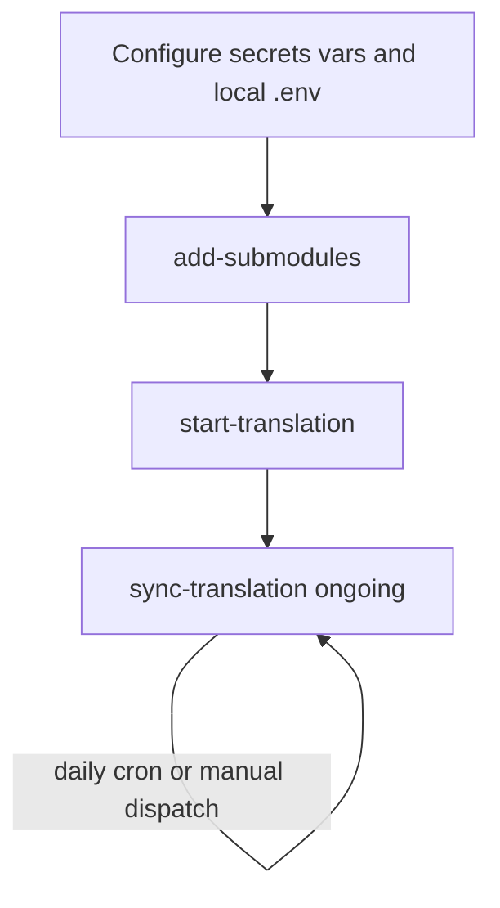

# Operator quick reference

Step-by-step checklist from zero configuration to a running Boost documentation
translation. For per-workflow detail see [README.md](../README.md); for design and
return codes see [ARCHITECTURE.md](ARCHITECTURE.md); for HTTP/dispatch shapes see
[endpoint-contract.md](endpoint-contract.md).



---

## 0. One-time GitHub configuration

Set these on the translations repository before dispatching any workflow:
**Settings → Secrets and variables → Actions**.

| Kind     | Name             | Required by                             | Notes                                                                                              |
| -------- | ---------------- | --------------------------------------- | -------------------------------------------------------------------------------------------------- |
| Secret   | `SYNC_TOKEN`     | all workflows                           | PAT with **`repo`** scope; **`add-submodules`** also needs permission to create org repos when creating new mirrors |
| Secret   | `WEBLATE_URL`    | `start-translation` only                | Base URL of the Weblate instance; the workflow appends **`WEBLATE_ENDPOINT_PATH`** from [env.sh](../.github/workflows/assets/env.sh) |
| Secret   | `WEBLATE_TOKEN`  | `start-translation` only                | API token for that endpoint                                                                        |
| Variable | `LANG_CODES`     | `add-submodules`, `start-translation`   | Default language codes when omitted from dispatch payload (e.g. `zh_Hans,ja`). Must be set here or passed as `client_payload.lang_codes` |
| Variable | `SUBMODULES_ORG` | optional                                | GitHub org for library mirror repos (e.g. `CppDigest`). If unset, mirrors live in the same org as this repository |

---

## 1. Local trigger setup (optional)

To use the helper scripts from a clone of this repo:

```bash
cp .env.example .env   # set GH_TOKEN (GITHUB_TOKEN is also accepted)
```

- **`GH_TOKEN`** is **client-side only** — permission to call `POST /repos/{owner}/{repo}/dispatches`. Workflows still use the GitHub **secrets** above on the server.
- Requires **curl** and **jq** or Python 3.

---

## 2. `add-submodules` — create mirrors and register submodules

**When:** greenfield setup or adding new library mirrors.

| Item     | Value                                                                 |
| -------- | --------------------------------------------------------------------- |
| Workflow | [`.github/workflows/add-submodules.yml`](../.github/workflows/add-submodules.yml) |
| Script   | `scripts/trigger-add-submodules.sh`                                   |
| Trigger  | `repository_dispatch` with `event_type: add-submodules`                 |

```bash
scripts/trigger-add-submodules.sh \
  --repo OWNER/boost-docs-translation \
  --version boost-1.90.0 \
  --submodules 'unordered, json' \
  --lang-codes zh_Hans
```

- Omit **`--lang-codes`** to use repository variable **`LANG_CODES`**.
- Omit **`--submodules`** to discover names from **`boostorg/boost`** `.gitmodules` at **`version`**.
- **Success:** script prints HTTP **204**; confirm the Actions job completes (see [Interpreting results](#interpreting-results) below).

---

## 3. `start-translation` — sync mirrors and notify Weblate

**When:** after mirrors exist under **`MODULE_ORG`** (from **`SUBMODULES_ORG`** or this repo's org) and **`.gitmodules`** is populated on **`master`**.

| Item     | Value                                                                   |
| -------- | ----------------------------------------------------------------------- |
| Workflow | [`.github/workflows/start-translation.yml`](../.github/workflows/start-translation.yml) |
| Script   | `scripts/trigger-start-translation.sh`                                 |
| Trigger  | `repository_dispatch` with `event_type: start-translation`               |

```bash
scripts/trigger-start-translation.sh \
  --repo OWNER/boost-docs-translation \
  --version boost-1.90.0 \
  --lang-codes zh_Hans \
  --extensions '.adoc, .qbk'
```

- Requires secrets **`WEBLATE_URL`** and **`WEBLATE_TOKEN`**. Weblate typically responds with HTTP **202** (async); **200** is also accepted.
- Omit **`--lang-codes`** to use repository variable **`LANG_CODES`**.

**Dispatch order:** do **not** skip step 2 on a fresh repo. **`start-translation`** reads **this repo's `.gitmodules`** and does **not** create org mirrors; a missing mirror is a **fatal** error (`Run add-submodules first.` — see [start-translation.yml](../.github/workflows/start-translation.yml) header and [translation.sh](../.github/workflows/assets/translation.sh)).

---

## 4. `sync-translation` — ongoing pointer roll-up

**When:** after **`local-*`** branches exist in the super-repo. Runs automatically **daily at 00:00 UTC** (`0 0 * * *`) or on manual dispatch.

| Item     | Value                                                                 |
| -------- | --------------------------------------------------------------------- |
| Workflow | [`.github/workflows/sync-translation.yml`](../.github/workflows/sync-translation.yml) |
| Script   | **None** — use the dispatches API, GitHub UI, or the curl example below |
| Trigger  | `repository_dispatch` with `event_type: sync-translation` (no `client_payload`) |

```bash
curl -sS -o /dev/null -w '%{http_code}\n' \
  -X POST -H "Authorization: Bearer $GH_TOKEN" \
  -H "Accept: application/vnd.github+json" \
  -H "X-GitHub-Api-Version: 2022-11-28" \
  -H "Content-Type: application/json" \
  -d '{"event_type":"sync-translation"}' \
  "https://api.github.com/repos/OWNER/REPO/dispatches"
```

- Requires secret **`SYNC_TOKEN`** only. Relies on **`.gitmodules`** URLs established by steps 2–3.

---

## Interpreting results

Workflow jobs collapse per-submodule return codes **0 / 1 / 2** into step exit **0 or non-zero**; code **`2` is never propagated** to the GitHub Actions step exit code. The local trigger scripts use a simpler **0 / 1** contract (success vs any error).

Full detail: **[ARCHITECTURE.md §6 — Shell return codes](ARCHITECTURE.md#6-shell-return-codes)**.

---

## Quick decision guide

| Situation                                       | Run                                              |
| ----------------------------------------------- | ------------------------------------------------ |
| New repo or new library mirrors                 | `add-submodules` → `start-translation`           |
| New Boost release on existing mirrors           | `start-translation`                              |
| Advance super-repo pointers after translator merges | `sync-translation` (or wait for daily cron) |
