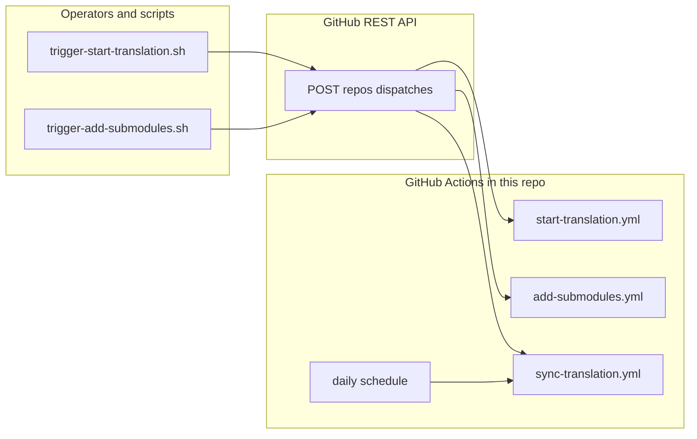

# Endpoint contract

**Status:** Operator-facing description of **inbound** HTTP surfaces used to trigger workflows in **this** repository. Labels: **documented** (paths and behavior match the checked-in workflows and scripts), **partial** (no helper script in-repo; still valid via GitHub API or schedule).

All file paths below are relative to the root of **this** repository.

## Overview

**GitHub REST API** — `POST /repos/{owner}/{repo}/dispatches` runs workflows via `repository_dispatch`. Helper scripts live under `scripts/`. `sync-translation` can also start on a **daily schedule** inside GitHub Actions (not an HTTP call you make).

---

## Endpoint inventory

| #   | Surface                | Method       | URL / path                                               | Defined or invoked in this repo                                                                                   | Label          |
| --- | ---------------------- | ------------ | -------------------------------------------------------- | ----------------------------------------------------------------------------------------------------------------- | -------------- |
| 1   | GitHub Actions trigger | `POST`       | `https://api.github.com/repos/{owner}/{repo}/dispatches` | `scripts/trigger-start-translation.sh`, `scripts/trigger-add-submodules.sh`                                       | **documented** |
| 2   | GitHub Actions trigger | `POST`       | same as (1)                                              | `sync-translation.yml` (manual dispatch or any client with repo access); no `scripts/trigger-*.sh` for this event | **partial**    |
| 3   | GitHub Actions         | _(schedule)_ | _(runs inside GitHub; not an HTTP URL you call)_         | `sync-translation.yml` — cron `0 0 * * *` (daily UTC)                                                             | **partial**    |

---

## GitHub `repository_dispatch` (`POST …/dispatches`)

**Purpose:** Start a workflow in this repository using the [Create a repository dispatch event](https://docs.github.com/en/rest/repos/repos#create-a-repository-dispatch-event) API.

### Common contract (helper scripts)

| Item          | Value                                                                                                       |
| ------------- | ----------------------------------------------------------------------------------------------------------- |
| URL           | `https://api.github.com/repos/{owner}/{repo}/dispatches`                                                    |
| Method        | `POST`                                                                                                      |
| Auth          | `Authorization: Bearer {PAT}` (scripts use `GH_TOKEN` / `GITHUB_TOKEN` / `--token`)                         |
| Headers       | `Accept: application/vnd.github+json`, `X-GitHub-Api-Version: 2022-11-28`, `Content-Type: application/json` |
| Success       | HTTP **204** (scripts treat only `204` as success and print the body on failure)                            |
| Response body | Empty on success; scripts do not parse JSON on success.                                                     |

### `event_type: add-submodules`

| Item             | Detail                                                                                                                |
| ---------------- | --------------------------------------------------------------------------------------------------------------------- |
| Workflow         | `.github/workflows/add-submodules.yml`                                                                                |
| Body shape       | `{"event_type":"add-submodules","client_payload":{...}}`                                                              |
| `client_payload` | All optional: `version`, `submodules` (list-like string), `lang_codes` (comma-separated). See [README](../README.md). |
| Script           | `scripts/trigger-add-submodules.sh` builds JSON with `jq` or Python; omits empty optional fields.                     |

### `event_type: start-translation`

| Item             | Detail                                                                       |
| ---------------- | ---------------------------------------------------------------------------- |
| Workflow         | `.github/workflows/start-translation.yml`                                    |
| Body shape       | `{"event_type":"start-translation","client_payload":{...}}`                  |
| `client_payload` | Optional: `version`, `lang_codes`, `extensions`. See [README](../README.md). |
| Script           | `scripts/trigger-start-translation.sh`                                       |

### `event_type: sync-translation`

| Item           | Detail                                                                                                  |
| -------------- | ------------------------------------------------------------------------------------------------------- |
| Workflow       | `.github/workflows/sync-translation.yml`                                                                |
| Triggers       | `repository_dispatch` **or** schedule **`0 0 * * *`** (daily, UTC).                                     |
| Body shape     | `{"event_type":"sync-translation"}` — no `client_payload`.                                              |
| Script in repo | **None** — use the dispatches API, GitHub UI, or another automation with permission to post dispatches. |

---

## Outbound Weblate (`POST …/${WEBLATE_ENDPOINT_PATH}`)

**Purpose:** Notify the Weblate instance which components to add or update after git sync.

| Item       | Value                                                                                          |
| ---------- | ---------------------------------------------------------------------------------------------- |
| URL        | `{WEBLATE_URL}/${WEBLATE_ENDPOINT_PATH}` — path from **`WEBLATE_ENDPOINT_PATH`** in `env.sh` |
| Method     | `POST`                                                                                         |
| Auth       | `Authorization: Token {WEBLATE_TOKEN}`                                                         |
| Invoked by | `.github/workflows/start-translation.yml` (`start-local` job)                                |
| Success    | HTTP **200** or **202** (async accepted)                                                       |
